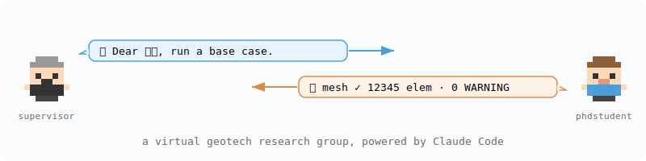

# geo-lab

[English](README.md) | 中文



用 Claude Code 模拟一个岩土工程课题组: 一个教授 + 一群人格各异的博士生, 跑 Abaqus 仿真.

## 结构

```
geo-lab/
├── .claude-plugin/plugin.json
├── agents/phdstudent.md         # 博士生, 按导师指示跑 Abaqus
├── agents/librarian.md          # 文献员, 抓公开文献到 literature/ + MANIFEST
├── commands/supervisor.md       # 入口 command, 扮演教授指挥学生
└── bin/call-student.sh          # 教授给学生发信的 wrapper
```

## 工作流

入口是 `/supervisor` — 扮演教授,通过 `call-student.sh` 给学生发信、收回信、维护 `group_homepage.md`. 学生是一个独立 `claude -p` session, 接到信跑 Abaqus、写报告、回信. 需要文献时教授或学生可以调 `librarian` 抓 open-access PDF 到 `literature/`.

## 性格系统

每招一个学生, `hash(name)` 决定他的人格 + 用哪个模型, 教授看不到, 要靠学生的回信观察:

- tag (6 选 1): 公式党 / 天才 / 学术妲己 / 经费刺客 / 试错派 / 卷神
- model (2 选 1): `claude` (Opus 4.7) / `claude-ds` (DeepSeek v4 pro)

学生 (name, tag, model, session_id) 落在 `geo-lab/students_<basename(cwd)>.yaml`. 同名再调脚本自动 resume.

## 如何运行

```bash
cd ~/Abaqus2024/<your_project>
claude --plugin-dir ../geo-lab --dangerously-skip-permissions
```

进 Claude Code 后:

```
/supervisor
```

## 相关项目

- arXiv 工具 (Claude Code 插件): <https://github.com/WhymustIhaveaname/arxiv-tools>
- Telegram 桥接 (Claude Code 插件): <https://github.com/WhymustIhaveaname/mcp-communicator-telegram>

## 合作

wang5240@purdue.edu
